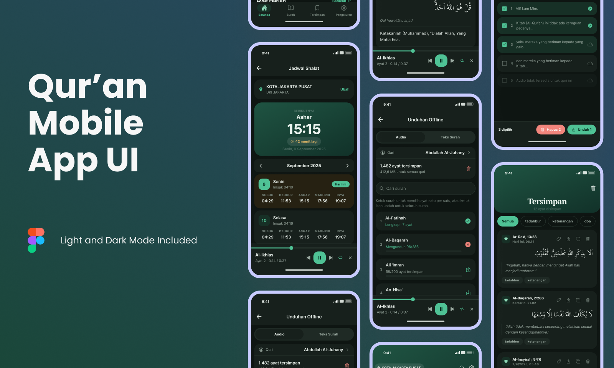

# Qur'an Indonesia (React Native)



This is an **Expo / React Native Qur'an reader** for iOS and Android, covering
reading, recitation, tafsir, bookmarks, daily supplications, prayer times and
offline use. All content comes from the [EQuran.id API v2](https://equran.id/apidev/v2).

---

## Design

The screens, components and color tokens are designed in Figma:

[**Qur'an Indonesia App Design**](https://www.figma.com/design/elfjZvpIIqWXMMfgCFmwXB/Qur-an-Indonesia-%E2%80%94-App-Design?m=auto&t=D9AvRFbhHcjAwTpz-6)

[DESIGN.md](DESIGN.md) records what that file resolves to in code: the palette,
the type scale, the motifs, and the reason behind each one.

---

## Features

- All 114 surah with Arabic, Latin transliteration and Indonesian translation
- Murottal from 6 qari, per ayah or whole surah, with background playback
- Tafsir per ayah, deep-linked from the reader
- Bookmarks with custom labels, plus reading history and continue-reading
- Prayer schedule per kabupaten/kota with a live countdown
- Adhan notifications with per-prayer toggles
- Daily doa, grouped and searchable
- Offline downloads for surah text and audio, per ayah or per surah
- Share an ayah as an image, with themes and layout options
- Light, dark and follow-the-system themes, all on one token palette

---

## Tech Stack

| Component           | Description                           |
| ------------------- | ------------------------------------- |
| React Native 0.86   | App framework, New Architecture       |
| Expo SDK 57         | Native modules and build tooling      |
| expo-router         | File-based routing on native stacks   |
| TypeScript          | Typed throughout                      |
| expo-audio          | Playback, queue and background audio  |
| AsyncStorage        | Settings, bookmarks and response cache |
| expo-file-system    | Downloaded audio files                |
| expo-notifications  | Scheduled adhan alerts                |
| Animated (RN)       | Collapsing headers, native-driven     |

---

## Setup Instructions

1. **Clone Repository**

   ```bash
   git clone https://github.com/deinf/quranapp.git
   cd quranapp
   ```
2. **Install Dependencies**

   ```bash
   npm install
   ```
3. **Requirements**

   Node 20+, and Xcode (iOS) or Android Studio (Android).
4. **Run on a Device or Simulator**

   ```bash
   npm run ios
   npm run android
   ```

   These call `expo run:*`, which generates the native projects and compiles
   them. `ios/` and `android/` are generated output and stay gitignored, so
   change `app.json` and let prebuild regenerate them.
5. **Bundler Only**

   For an already-installed dev build:

   ```bash
   npm start
   ```
6. **Typecheck**

   ```bash
   npm run tsc
   ```

---

## Features Checklist

### Reading

- [X] All 114 surah, Arabic and translation
- [X] Latin transliteration, toggleable
- [X] Adjustable Arabic size (20-44pt) and three Arabic faces
- [X] Jump to a surah or an ayah by number, `18:23` style
- [X] Tafsir per ayah

### Recitation

- [X] Play from any ayah to the end of the surah
- [X] Whole-surah murottal
- [X] Six qari, switchable from a bottom sheet
- [X] Repeat off / all / one, scrub and skip
- [X] Background playback
- [ ] Lock-screen and notification controls
- [X] Reader follows the playing ayah

### Library

- [X] Bookmark an ayah
- [X] Custom and suggested labels, with filtering
- [X] Reading history
- [X] Continue reading with progress

### Prayer Times

- [X] Monthly schedule per kabupaten/kota
- [X] Next prayer with a live countdown
- [X] Two-step province and city picker, persisted
- [X] Adhan notifications with a bundled adhan sound
- [X] Per-prayer toggles and sound choice

### Offline

- [X] Every surah opened is cached
- [X] One-tap download of the whole Qur'an text
- [X] Audio download per ayah or per surah
- [X] Player prefers local files
- [X] Storage usage and per-qari breakdown

### Other

- [X] First-launch onboarding
- [X] Theme picker: system, light, dark
- [X] Daily verse on the home screen
- [X] Share an ayah as an image or as text
- [X] Doa collection, grouped and searchable
- [X] Haptics and toast confirmations

---

## Contact

**Danang Eka Saputra**
GitHub: [@deinf](https://github.com/deinf)
Email: danangekasaputra@outlook.com

---
